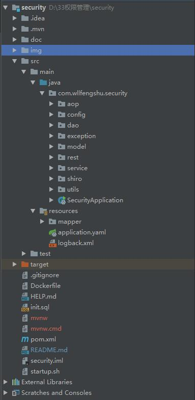
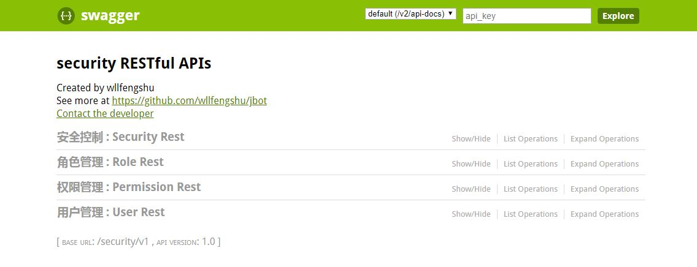
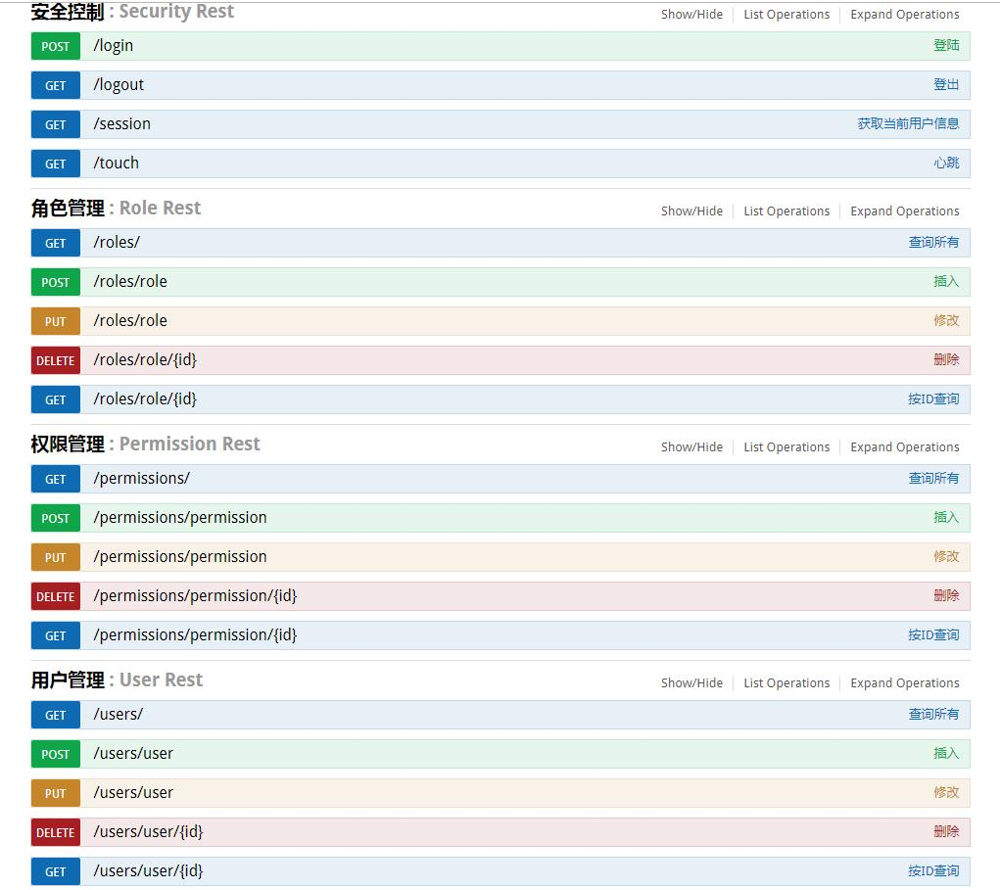

# 权限管理

> 包含如下内容：  
> 1、登陆、登出、心跳、查询当前登陆的用户信息  
> 2、用户管理  
> 3、角色管理  
> 4、权限管理  

## swagger文档地址：
  [http://localhost:8080/security/v1/swagger-ui.html](http://localhost:8080/security/v1/swagger-ui.html "http://localhost:8080/security/v1/swagger-ui.html")

## markdown文档地址：
  本项目根目录doc路径

## 注意：
   本项目使用了lombok，使用idea时请务必先安装这个插件！

## 技术选型
技术 | 名称
----|------
Spring Boot | 容器  
MyBatis | ORM框架
Druid | 数据库连接池
Swagger2 | 接口测试框架
Maven | 项目构建管理
lombok | POJO简化工具
logstash | 日志管理
mapper | 通用mapper
pagehelper | 分页插件
shiro | 安全框架

## 示例图

- 项目工程图  

- swagger图  

- 接口图  

> 本项目使用jbot生成：github地址：[https://github.com/wllfengshu/jbot](https://github.com/wllfengshu/jbot "jbot")

  

- 注意：
本项目在查询“角色对应的权限”，以及“用户对应的角色”时，存在查询效率的“n+1问题”。也就是说，假设有10个角色，那么
在查询这10个角色对应的权限时，会发出10+1个sql。

> 参考：  
- 1、shiro的demo  
https://github.com/CaiBaoHong/elegant-shiro-boot/
- 2、springboot+shiro官网教程  
http://shiro.apache.org/spring-boot.html
- 3、mybatis中collection一对多关联查询分页出错  
https://blog.csdn.net/baidu_38116275/article/details/78622669
- 4、mybatis中collection子查询不执行  
https://blog.csdn.net/yu514950381/article/details/82491127
- 5、springboot+shiro的start方式使用教程  
https://segmentfault.com/a/1190000014479154  
https://blog.csdn.net/qq_32867467/article/details/83045505
- 6、基于redis的会话管理  
https://blog.csdn.net/xieliaowa9231/article/details/78995465
- 7、多次从redis获取session问题  
https://blog.csdn.net/lianyuecheng/article/details/81663269

> 后续：
1、微服务如何做安全控制  
http://wwwbuild.net/greatops/414179.html

- 经过这次的设计个人感觉shiro并不适合做微服务的安全框架，原因如下：
  - 1、从session的角度看：
shiro维护的只是“登陆的应用”和security的会话，对第三方应用通过sessionId获取权限的操作
并不友好。当然解决办法是有的，就是把第三方传过来的sessionId去缓存（redis）中查询，如果查到了，返回对应的权限
即可。但是，这样做的话完全没必要使用shrio，我在用户登陆的时候把用户信息都存放在redis中，并且设置一个key,然后
第三方应用通过这个key就可获取到数据。
  - 2、从授权的角度看：
在配置shiro的拦截器时，有两种办法，第一种，通过url做控制。第二种，放行全部的
url,权限控制通过注解的方式做。其实这两种方法我们不使用shiro也可以做，而且shiro在读取缓存做授权控制时，还存在频
繁访问/更新redis的问题。虽然有办法解决该问题，但是对于系统来说不够完美，多了一个类，而且废弃了父类的一个方法，
（我是完美主义者）。不使用shiro的做法，当有请求时，我先去redis中获取用户权限，然后检查是否授权正确，非常简单的
逻辑，像本项目中，为了做一个redis的缓存，写了4个类，完全不能忍啊。
  - 3、从单点登陆的角度看：
微服务必须实现单点登陆，但是shiro显然不友好。例如我第三方服务需要通过sessionId获取该用户的数据权限，但是我第
三方不可能先去登陆一次啊。你可能会说，你不用登陆啊，直接对该请求放行，然后从redis中获取数据即可，那请问，我都
没有登陆，却能直接获取到数据，那我还需要shiro干嘛。当然，这是一个悖论，要想安全就必须先进行登陆，否则不能进行
任何操作。但是在微服务架构下，又需要用单点登陆。那有一种解决办法，就是只对登陆做控制，登陆的目的是为了获取信
用的凭证（例如sessionId），对于其他的请求不做任何控制。那从这个角度看，就更加没有必要使用shiro了。我们公司上
一个版本的security是我们的技术总监写的，他也使用了shiro，但是只用来做登陆，其他的操作都是他自己实现的。现在
我终于明白了他为什么那样做了。
- 本项目将不会实现单点登陆，也就是说本项目适用于非微服务架构。这里的shiro对每个请求都进行权限认证，第三方服务
无法在未登陆状态下调用security的接口，确保了请求的安全性。下个版本我会不使用shiro做安全管理，其基本功能类似，
但是我不再管理session，我只管理当前登陆的用户信息。再下一个版本我会去学习spring cloud security，力争研究一个
最适合于微服务的安全框架。
